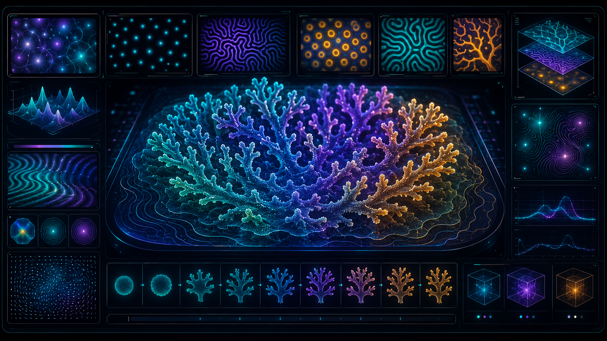

<p align="center">
  
</p>

<h1 align="center">Reaction–Diffusion Morphogenesis Lab</h1>

<p align="center">
  <strong>An interactive Gray–Scott reaction–diffusion simulator for biological pattern formation.</strong>
</p>

<p align="center">
  <a href="https://biswajit1999.github.io/reaction-diffusion-morphogenesis-lab/">Live Demo</a>
  ·
  <a href="#what-is-this-project">What is this?</a>
  ·
  <a href="#scientific-model">Scientific Model</a>
  ·
  <a href="#features">Features</a>
  ·
  <a href="#roadmap">Roadmap</a>
</p>

---

## What is this project?

 
This is an interactive simulation of **reaction–diffusion**, a mathematical model that helps explain how simple local rules can generate complex natural-looking patterns.

In nature, related pattern-forming processes appear in:
=======
This is an interactive simulation of **reaction–diffusion**, a mathematical idea that explains how simple local rules can create complex natural-looking patterns.

In nature, similar pattern-forming ideas appear in things like:

- animal skin patterns
- spots and stripes
- coral-like growth
- chemical waves
- biological morphogenesis
- self-organising structures

This project lets users change the simulation parameters and watch patterns grow, split, stabilise, or become unstable in real time.

 
The aim is to build a scientific simulation that is:
=======
The goal is to make a scientific simulation that is:
 

- simple enough for students to understand
- visual enough for science communication
- clean enough for GitHub users to fork
 
- flexible enough for advanced learners and researchers to extend
=======
- flexible enough for researchers or advanced learners to extend
 

---

## Live Demo

Try the interactive tool here:

```text
https://biswajit1999.github.io/reaction-diffusion-morphogenesis-lab/
 
```

---

## In simple words

Think of this project as a **digital petri dish**.

Inside the simulation, there are two imaginary chemicals.

One chemical spreads and feeds the system.  
The other chemical reacts, grows, spreads, and competes with it.

At first, the rules are very simple. But after many small updates, the surface begins to form patterns that look surprisingly natural: spots, stripes, branching shapes, maze-like structures, and coral-like growth.

The interesting part is that nobody is drawing those shapes manually.

They emerge from the rules.

That is the main idea:

```text
simple local rules → complex global patterns
```

---

## Scientific Model

This project uses the **Gray–Scott reaction–diffusion model**.

There are two chemical fields:

- `A` — the feed chemical
- `B` — the activator chemical

The equations are:

```text
∂A/∂t = D_A ∇²A − A B² + F(1 − A)

∂B/∂t = D_B ∇²B + A B² − (k + F)B
```

Where:

| Symbol | Meaning |
|---|---|
| `A` | concentration of chemical A |
| `B` | concentration of chemical B |
| `D_A` | diffusion rate of A |
| `D_B` | diffusion rate of B |
| `F` | feed rate |
| `k` | kill rate |
| `∇²` | diffusion / spreading term |

The simulation repeatedly updates these equations across a grid of pixels. Each pixel reacts with its neighbours, and over time large-scale structure emerges.

---

## Features

- Interactive Gray–Scott reaction–diffusion simulation
- Drag on the canvas to inject chemical `B`
- Multiple presets:
  - coral growth
  - dividing spots
  - worm trails
  - zebra stripes
  - maze instability
- Adjustable scientific parameters:
  - feed rate
  - kill rate
  - diffusion of A
  - diffusion of B
  - simulation speed
  - brush size
- Adjustable visual settings:
  - colour palette
  - contrast
  - glow
- Real-time telemetry:
  - mean activator level
  - variance
  - edge energy
  - active area
- Live morphology trace graph
- Day/night background toggle
- Lightweight HTML/CSS/JavaScript implementation
- Works directly with GitHub Pages

---

## How to use the simulator

Open the live demo and try the following:

1. Choose a preset from the left panel.
2. Drag on the main field to inject chemical `B`.
3. Change the feed rate `F` slightly.
4. Change the kill rate `k` slightly.
5. Watch how the pattern changes over time.

Small changes can create very different structures.

That sensitivity is one of the interesting parts of nonlinear systems.

---

## Why this project is useful

Many scientific simulations are either visually interesting but hard to understand, or scientifically serious but difficult to run.

This project is intentionally simple:

- one single `index.html` file
- no framework
- no build tools
- no installation required
- no backend
- runs directly in the browser
- easy to fork and modify

A school student can explore it visually.  
An undergraduate can read the code and understand the model.  
A researcher can fork it and add more advanced numerical analysis.

---

## How to Run Locally

You can simply open:

```text
index.html
```

in a browser.

For a cleaner local server, run:

```bash
python -m http.server 8000
```

Then open:

```text
http://localhost:8000
```

---

## Project Structure

```text
reaction-diffusion-morphogenesis-lab/
│
├── index.html
├── README.md
├── LICENSE
└── images/
    └── reaction-diffusion-hero.png
```

---

## Built With

- HTML5
- CSS3
- JavaScript
- Canvas API
- GitHub Pages

No external framework is required.

---

## Suggested Repository Topics

```text
reaction-diffusion
gray-scott
morphogenesis
pattern-formation
simulation
scientific-computing
javascript
html5-canvas
education
```

---

## Roadmap

Possible future improvements:

- WebGL / GPU version
- PNG image export
- parameter sweep mode
- side-by-side pattern comparison
- Fourier spectrum analysis
- automatic pattern classification
- mobile UI improvements
- Python notebook version
- research-style documentation page
- blog post explaining the science behind the model

---

## Visual Credit

The README hero image is an AI-generated conceptual scientific illustration created for this project.

It is used as an artistic representation of reaction–diffusion morphogenesis and should not be interpreted as measured scientific data, microscope imagery, or a direct output of the simulator.

---

## Author

Created by **Biswajit Jana** as part of an academic and scientific computing portfolio.

Portfolio website:

```text
https://biswajit1999.github.io/Biswajit_Jana.github.io/
```

---

## License

This project is released under the MIT License.

You may use, modify, and fork the code. If you reuse the project publicly, attribution to the original author is appreciated.

```text
© 2026 Biswajit Jana. All rights reserved for original project design, documentation, and visual presentation.
```
=======

## Research Quality Upgrade

See [RESEARCH_QUALITY.md](RESEARCH_QUALITY.md) for the validation layer, reference anchors, equations and research boundaries added to this repository.
